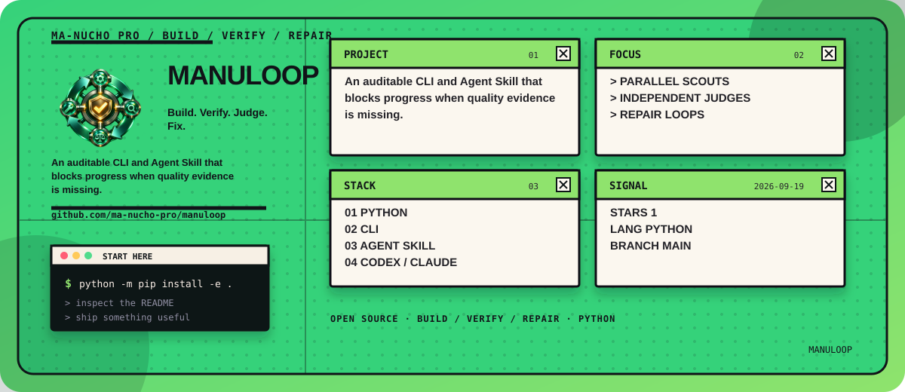
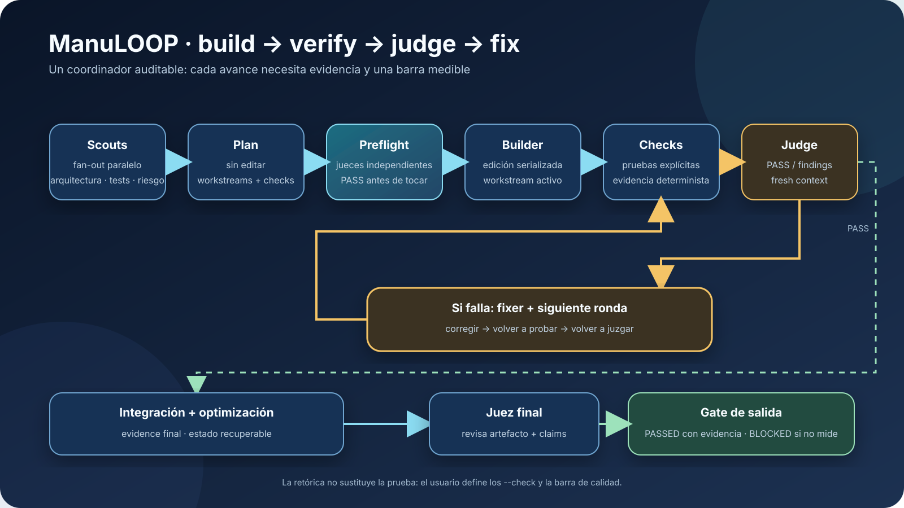

<!-- manucho-readme-banner:start -->

  

<!-- manucho-readme-banner:end -->

  

# ManuLOOP

ManuLOOP es un coordinador local y auditable para ejecutar un ciclo de calidad
tipo Gauntlet Loop con Claude Code, Codex, Gemini CLI o cualquier harness que
pueda recibir un prompt por línea de comandos.

Su idea central no es pedirle a un único agente que se califique a sí mismo.
ManuLOOP separa los roles y bloquea el avance cuando no hay evidencia:

~~~text
exploradores en paralelo
        ↓
plan sin editar
        ↓
jueces independientes de preflight
        ↓ PASS
builder → pruebas → juez → fixer → pruebas → juez
        ↓
integración/optimización → juez final → gate de salida
~~~

  

El loop no afirma que algo sea “absolutamente perfecto” por retórica. Solo
termina con PASSED cuando los jueces y las comprobaciones deterministas
configuradas pasan. Si la afirmación no puede medirse, termina en BLOCKED.

## Instalación

Requiere Python 3.10 o posterior. No tiene dependencias externas.

~~~powershell
cd C:\ruta\a\ManuLOOP
python -m pip install -e .
manuloop --version
~~~

También puede ejecutarse sin instalarlo:

~~~powershell
python -m manuloop --version
~~~

## Arquitectura híbrida y repositorio público

ManuLOOP tiene dos entradas al mismo protocolo:

- La skill manuloop, ubicada en .agents/skills/manuloop, es la interfaz
  nativa para Codex. Invócala dentro de Codex con $manuloop.
- El comando manuloop es el CLI multi-provider para lanzar procesos de
  Claude Code, Codex CLI, Gemini CLI o un harness personalizado.

El repositorio público contiene ambas piezas. Para instalar la versión del
repositorio:

~~~powershell
git clone https://github.com/ma-nucho-pro/manuloop.git
cd manuloop
python -m pip install -e .
manuloop --version
~~~

Si quieres que Codex descubra la skill para cualquier repositorio, copia
.agents/skills/manuloop a tu directorio de skills de usuario:

~~~powershell
$destination = Join-Path $env:USERPROFILE '.codex\skills\manuloop'
New-Item -ItemType Directory -Force (Split-Path $destination) | Out-Null
Copy-Item -Recurse -Force '.agents\skills\manuloop' $destination
~~~

Si trabajas dentro del repositorio clonado, Codex puede descubrir la skill
desde .agents/skills sin hacer esa copia global.

## Uso rápido con Codex

Inicializa la configuración del proyecto:

~~~powershell
manuloop init
manuloop providers
~~~

Primero valida el plan sin permitir cambios:

~~~powershell
manuloop plan --provider codex --goal "Implementa la autenticación de esta aplicación" --bar "tests de autenticación pasan, typecheck pasa, no hay secretos hardcodeados y los errores de runtime quedan reproducidos o corregidos" --domain code
~~~

Después ejecuta el loop completo. Los comandos de --check son explícitos y
pertenecen al usuario; ManuLOOP no ejecuta automáticamente comandos inventados
por un agente:

~~~powershell
manuloop run --provider codex --judge-provider codex --goal "Implementa la autenticación de esta aplicación" --bar "tests, typecheck, build y revisión de errores de runtime pasan" --domain code --allow-edits --check "pytest -q" --check "npm run typecheck" --check "npm run build"
~~~

--allow-edits es deliberado: el modo de planificación es de solo lectura y
el modo de implementación no toca el workspace si no se concede esta opción.
Usa un branch o worktree limpio para ejecuciones largas.

## Claude Code y Gemini CLI

Los perfiles incluidos usan los modos no interactivos de cada CLI:

| Provider | Builder/fixer | Explorador/juez |
| --- | --- | --- |
| claude | claude -p --output-format json --permission-mode acceptEdits | --permission-mode plan |
| codex | codex exec --sandbox workspace-write --json | --sandbox read-only --json |
| gemini | gemini --prompt ... --output-format json --approval-mode auto_edit | --approval-mode plan |

La sintaxis se mantiene en manuloop/config.py para que puedas ajustarla a
una versión, proveedor o política local. Claude Code documenta -p,
--output-format y --permission-mode; Codex documenta codex exec,
--sandbox y --json; Gemini CLI documenta --prompt, --output-format y
--approval-mode.

Ejemplo con Claude:

~~~powershell
manuloop run --provider claude --goal "Corrige los errores de la API" --bar "pytest, lint y pruebas de integración pasan" --domain code --allow-edits --check "pytest -q" --check "ruff check ."
~~~

Ejemplo con Gemini:

~~~powershell
manuloop run --provider gemini --goal "Mejora este juego 2D sin romper el bucle principal" --bar "arranque reproducible, controles funcionales, consola sin errores y medición de FPS estable" --domain game --allow-edits --check "npm test" --check "npm run build"
~~~

Para “que no haya lag” debes proporcionar una medición real: por ejemplo, un
smoke test que arranque el juego, capture FPS/frametime durante una escena
representativa y falle bajo el umbral acordado. El juez no transforma
“parece fluido” en una medición.

## Harnesses no incluidos

Si usas Cursor, un CLI propio, un runner de cursos o cualquier harness con
otra interfaz, genera un prompt portable:

~~~powershell
manuloop prompt --goal "Construye el dashboard solicitado" --bar "flujo principal completo, pruebas pasando, sin errores de consola y accesibilidad básica" --domain web --output MANULOOP_PROMPT.md
~~~

Ese prompt contiene el protocolo completo: fan-out inicial, validación del
plan antes de editar, jueces de contexto fresco, loop builder/pruebas/juez/fix
y gate final. Si el harness ofrece /loop, lo usa; si no, describe el
equivalente manual o sus primitivas de subagentes.

También puedes configurar un provider arbitrario en .manuloop/config.json:

~~~json
{
  "provider": "custom",
  "judge_provider": "custom",
  "providers": {
    "custom": {
      "command": ["mi-harness", "--prompt", "{prompt}", "--json"],
      "readonly_command": ["mi-harness", "--prompt", "{prompt}", "--read-only", "--json"],
      "output": "json"
    }
  }
}
~~~

El placeholder {prompt} se reemplaza como un argumento seguro del proceso,
sin construir una cadena para un shell. Si el placeholder no aparece, el
prompt se envía por stdin.

## Configuración

manuloop init crea .manuloop/config.json. Los flags de la CLI tienen
precedencia sobre la configuración:

~~~json
{
  "provider": "codex",
  "judge_provider": "auto",
  "scout_count": 4,
  "judge_count": 2,
  "preflight_rounds": 2,
  "max_rounds": 3,
  "timeout_seconds": 1800,
  "allow_edits": false,
  "allow_no_checks": false,
  "integration_pass": true,
  "checks": ["pytest -q"]
}
~~~

El provider de jueces se intenta separar del builder cuando hay otro CLI
instalado. Si solo existe un provider, cada juez sigue siendo un proceso nuevo
con un prompt de contexto fresco; puedes forzarlo con --judge-provider.

Los exploradores y jueces se ejecutan en paralelo. Las modificaciones de
builders/fixers se serializan en el workspace compartido para impedir que dos
procesos pisen archivos entre sí. Este comportamiento es intencional: el
fan-out temprano conserva velocidad sin convertir ediciones concurrentes en
corrupción de estado.

## Recibos, estado y diagnóstico

Cada ejecución escribe en .manuloop/runs/<run-id>/:

~~~text
request.json
plan-*.json
scout-reports.json
plan-judging-judgments.json
agents/<fase-agente>/
checks-*.json
evidence-*.json
events.jsonl
state.json
~~~

Consulta el último estado:

~~~powershell
manuloop status
manuloop status --json
~~~

Los recibos contienen prompts, stdout, stderr, respuestas estructuradas,
pruebas y evidencia Git para poder auditar por qué un gate pasó o se bloqueó.

## Contrato de jueces

Los jueces deben responder con:

~~~json
{
  "verdict": "PASS|FAIL|BLOCKED",
  "confidence": 0.0,
  "checks": [
    {"name": "tests", "status": "PASS", "evidence": "pytest -q: 42 passed"}
  ],
  "critical_findings": [],
  "next_action": "..."
}
~~~

PASS exige evidencia. FAIL significa que hay un problema reproducible o
una condición incumplida. BLOCKED significa que no se puede concluir sin
inventar una medición. Una respuesta no válida se trata como BLOCKED.

## Límites honestos

- Ningún loop puede demostrar ausencia absoluta de bugs fuera de su cobertura.
  La calidad final depende de una barra concreta y de checks que observen el
  comportamiento relevante.
- Los agentes reciben permisos que ya tengan sus CLIs. --allow-edits no
  convierte un entorno en sandbox; revisa las políticas de Claude, Codex o
  Gemini y trabaja en un checkout recuperable.
- Los comandos de pruebas se configuran explícitamente por el usuario. La
  salida de un agente no puede inyectar automáticamente nuevos comandos.
- La ejecución puede consumir muchos tokens: son varios exploradores, jueces,
  builders y rondas de corrección.

## Desarrollo

~~~powershell
python -m compileall -q manuloop
python -m unittest discover -s tests -v
~~~

El proyecto es MIT. La técnica Gauntlet Loop se atribuye a sus autores
originales; ManuLOOP es una implementación independiente del patrón de
builder, juez independiente, evidencia y repetición acotada.
